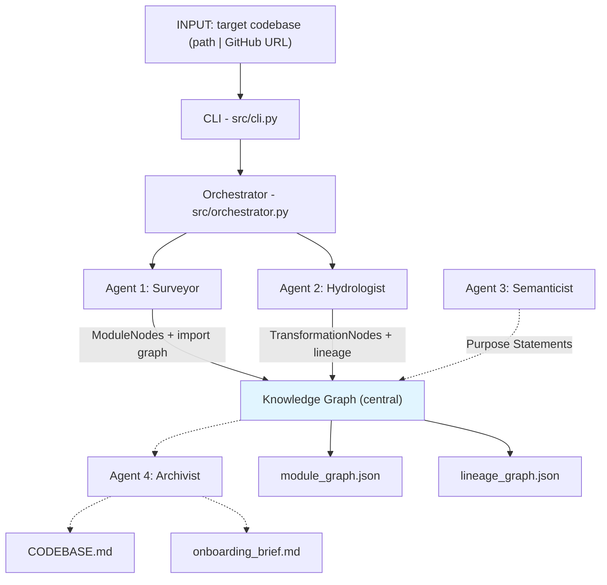

## Brownfield Cartographer

Codebase intelligence system for brownfield data engineering and analytics repositories. Ingests a local path or GitHub URL and produces a **system map** (module import graph) and **data lineage graph** (from SQL and YAML config).

### Architecture (four-agent pipeline)



Full diagram with labels: see [docs/architecture.mmd](docs/architecture.mmd).

### Installation

**With pip:**
```bash
pip install -e .
```

**With uv (recommended for locked deps):**
```bash
uv sync
# or: uv pip install -e .
```

### Run full analysis

Full pipeline (Surveyor → Hydrologist → Semanticist → Archivist). Use a local path or GitHub URL (cloned into current directory):

```bash
cartographer analyze .
cartographer analyze /path/to/repo
cartographer analyze https://github.com/dbt-labs/jaffle_shop
cartographer analyze . --incremental   # re-analyze only changed files since last run
```

**Artifacts in `.cartography/`:**

- **`module_graph.json`** — modules, import edges, PageRank, purpose_statement, domain_cluster.
- **`lineage_graph.json`** — datasets and transformations (SQL, YAML, Python data flow).
- **`CODEBASE.md`** — living context for AI coding agents (architecture, critical path, sources/sinks, debt, high-velocity files).
- **`onboarding_brief.md`** — five FDE Day-One answers with evidence.
- **`cartography_trace.jsonl`** — audit log of agent actions.
- **`semantic_index/purpose_index.json`** — module path → purpose statement (for search).

**LLM (purpose statements + Day-One synthesis):**

- **OpenRouter (free):** Sign up at [openrouter.ai](https://openrouter.ai), create an API key, then:
  ```bash
  export OPENROUTER_API_KEY=sk-or-v1-xxxxxxxx
  # Optional: base URL defaults to https://openrouter.ai/api/v1
  export OPENROUTER_API_BASE=https://openrouter.ai/api/v1
  ```
  The Semanticist uses **Google Gemini 2.0 Flash** on OpenRouter by default (free tier).

- **OpenAI:** `export OPENAI_API_KEY=sk-...` (uses gpt-4o-mini / gpt-4o).

Without any key, stub purpose text and Day-One answers are used.

### Query mode (Navigator)

After analyzing a repo, run interactive queries (find_implementation, trace_lineage, blast_radius, explain_module):

```bash
cartographer query /path/to/repo
```

Then ask in natural language, e.g. “upstream of raw.customers”, “blast radius of src/orchestrator.py”, “explain src/cli.py”.

### Web UI (Streamlit)

A browser-based interface to run analysis, view artifacts, and run Navigator queries:

```bash
pip install -e ".[ui]"   # or: uv pip install -e ".[ui]"
streamlit run app_ui.py
```

- **Analyze**: enter repo path or GitHub URL, optional branch and incremental; run full pipeline.
- **Artifacts**: view CODEBASE.md, onboarding_brief.md, and graph summaries from `.cartography/`.
- **Query**: run Navigator questions (lineage, blast radius, explain, find) from the UI.

### Components

- **CLI** (`src/cli.py`): `analyze` and `query` subcommands; `--incremental`, `--output-dir`, `--branch`.
- **Orchestrator**: full pipeline; optional incremental (re-analyze changed files only).
- **Surveyor, Hydrologist, Semanticist, Archivist, Navigator** in `src/agents/`.
- **Models, analyzers, knowledge graph** in `src/models/`, `src/analyzers/`, `src/graph/`.

