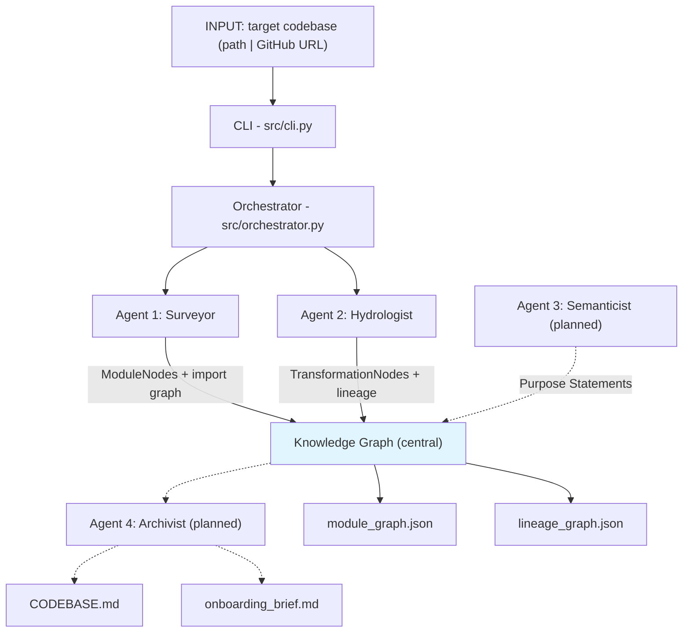

## Brownfield Cartographer

Codebase intelligence system for brownfield data engineering and analytics repositories. Ingests a local path or GitHub URL and produces a **system map** (module import graph) and **data lineage graph** (from SQL and YAML config).

### Architecture (four-agent pipeline)



Full diagram with labels: see [docs/architecture.mmd](docs/architecture.mmd).

### Installation

**With pip:**
```bash
pip install -e .
```

**With uv (recommended for locked deps):**
```bash
uv sync
# or: uv pip install -e .
```

### Run analysis

Analyze a local directory or a GitHub URL (it will be cloned into the current directory):

```bash
cartographer .
cartographer /path/to/other/repo
cartographer https://github.com/dbt-labs/jaffle_shop
```

This creates a **`.cartography/`** folder inside the target repo with:

- **`module_graph.json`** — nodes (files), edges (imports), and PageRank.
- **`lineage_graph.json`** — datasets and transformations from `.sql` and dbt/Airflow-style YAML.

### Interim deliverables (March 12)

- `src/cli.py` — entry point; takes repo path (local or GitHub URL), runs analysis.
- `src/orchestrator.py` — runs Surveyor then Hydrologist, writes `.cartography/` artifacts.
- `src/models/` — Pydantic schemas (ModuleNode, DatasetNode, TransformationNode, EdgeTypes).
- `src/analyzers/tree_sitter_analyzer.py` — multi-language AST parsing, LanguageRouter.
- `src/analyzers/sql_lineage.py` — sqlglot-based SQL table dependency extraction.
- `src/analyzers/dag_config_parser.py` — Airflow/dbt YAML config parsing.
- `src/agents/surveyor.py` — module graph, PageRank, git velocity, dead-code candidates.
- `src/agents/hydrologist.py` — DataLineageGraph, blast_radius, find_sources/find_sinks.
- `src/graph/knowledge_graph.py` — NetworkX wrapper and JSON serialization.

See **RECONNAISSANCE.md** for manual Day-One analysis of the primary target and **INTERIM_REPORT.md** for architecture, progress, and known gaps.

